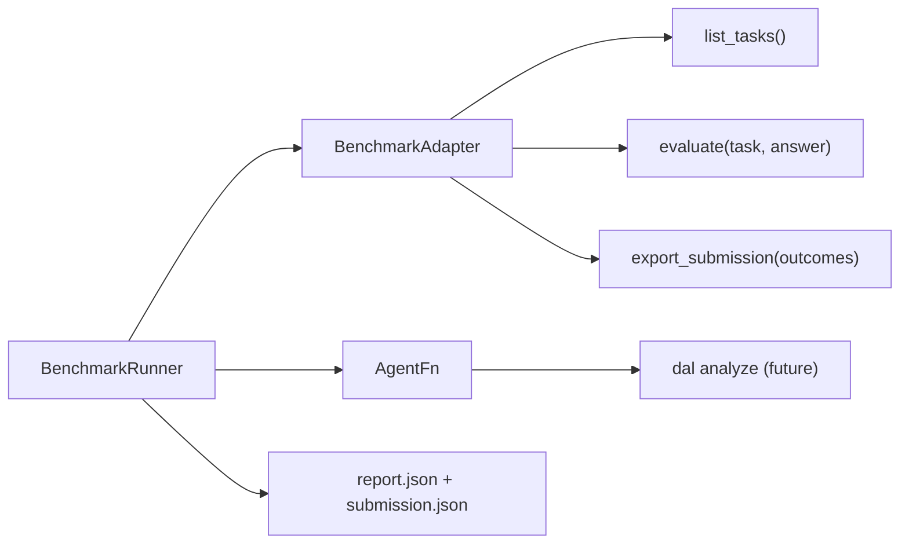

# Evaluation Strategy and Benchmark Adapters

Version: 0.1  
Date: 2026-06-14  
Status: Adapter framework implemented; `analyze` agent integration active for golden tasks.

## 1. Purpose

Data-Agent-Lab evaluates correctness through **two parallel tracks** that must not contaminate each other:

| Track | Purpose | When |
| --- | --- | --- |
| **Product golden tasks** | Regression gate for Core features (PSE, profiling, validation) | Every slice S1–S3 |
| **External benchmark adapters** | Comparable pass@1 against published suites | After Core gate; expand by stage |

Benchmark adapters are built **in parallel** with the agent so we can:

- Define task/evaluator contracts early.
- Smoke-test the runner before the full `dal analyze` pipeline exists.
- Export leaderboard-ready JSON (DataAgentBench) without benchmark-specific hacks in core logic.

## 2. Adapter Architecture



### 2.1 Core types

- `BenchmarkTask` — question, data paths, tags, stage, metadata.
- `TaskRunOutcome` — per-trial answer, pass/fail, reason, latency.
- `BenchmarkReport` — aggregated pass rate and per-task rates.
- `AgentFn` — `(task) -> answer` callable; swapped from stub to real agent.

### 2.2 Registered adapters

| CLI name | Stage | Data requirement | Evaluator source |
| --- | --- | --- | --- |
| `golden` | Internal | `tests/golden/*/task.json` | JSON spec in task file |
| `infiagent` | Stage 2 | Local manifest + CSV paths | Closed-form expected value |
| `dab` | Stage 4 | DataAgentBench clone (`--root`) | Per-query `validate.py` |

Implementation lives under `data_agent_lab/benchmarks/`.

## 3. Golden Task Format

Each golden task is a directory:

```text
tests/golden/{name}/
  task.json
  data/
    *.csv
```

`task.json` schema:

```json
{
  "task_id": "csv_revenue_agg/electronics_feb",
  "question": "What was Electronics revenue in 2024-02?",
  "data_paths": ["data/revenue.csv"],
  "tags": ["core", "descriptive", "s2"],
  "subset": "core",
  "evaluator": {
    "type": "numeric_tolerance",
    "expected": 1500,
    "tolerance": 0.01
  }
}
```

Supported evaluator types (MVP):

- `exact` — normalized string equality
- `contains` — substring match
- `numeric_tolerance` — parse first number, compare within tolerance
- `artifact_exists` — file path exists (for full agent runs)

## 4. External Benchmark Stages

Aligned with PROJECT_DESIGN §14.3, with **adapter readiness** called out explicitly:

| Stage | Adapter | Core gate | Notes |
| --- | --- | --- | --- |
| 1 | `golden` | >= 70% Core golden pass | Shipped; current Core golden pass is 6/6 |
| 2 | `infiagent` | Core gate + manifest | CSV closed-form; manifest maps DAEval subset |
| 3 | — | DataSciBench-style | Deferred; design TBD |
| 4 | `dab` | S3 complete | SQLite/DuckDB subset only (`DAB_SQLITE_DUCKDB_DATASETS`) |
| 5 | `dab` full | PostgreSQL/MongoDB connectors | Full 54-query suite |

### 4.1 InfiAgent-DABench adapter

Upstream repo is large; we do **not** vendor it. Provide a slim manifest:

```bash
dal bench list --adapter infiagent \
  --root examples/infiagent_manifest \
  --manifest examples/infiagent_manifest/benchmark_manifest.json
```

For full DAEval, generate `benchmark_manifest.json` from the upstream validation set (future script).

### 4.2 DataAgentBench adapter

Clone upstream separately:

```bash
git clone https://github.com/ucbepic/DataAgentBench.git third_party/DataAgentBench
dal bench list --adapter dab --root third_party/DataAgentBench --subset bookreview
```

Default subset excludes MongoDB/PostgreSQL-only datasets until connectors ship.

Evaluation delegates to each query's `validate.py` (same contract as upstream).

Leaderboard export format:

```json
[
  {"dataset": "bookreview", "query": "1", "run": 0, "answer": "2020s"}
]
```

```bash
dal bench export --adapter dab --run-dir runs/benchmarks/dab_xxx --output dab_submission.json
```

## 5. CLI Usage

```bash
pip install -e ".[dev]"

# Adapter catalog
dal bench adapters

# Internal golden suite
dal bench list --adapter golden --tag core
dal bench run --adapter golden --agent analyze --tag core

# Saved report
dal bench report runs/benchmarks/golden_20260614T120000Z/report.json
```

Exit codes:

- `0` — all trials passed (stub run) or report printed successfully
- `1` — no tasks / user error
- `2` — run completed with failures (useful for CI gates)

## 6. Integration with Agent Pipeline

The benchmark runner can call the current `dal analyze` pipeline through:

```python
def analyze_agent(task: BenchmarkTask) -> str:
    run = analyze(question=task.question, data_sources=task.data_paths)
    return run.final_answer
```

Benchmark runs must still write full artifact packages under `runs/{run_id}/` for reproducibility; the adapter only consumes the final answer string for pass/fail.

## 7. Metrics Reported

Every `report.json` includes:

- Overall pass rate
- Per-task pass rate (important for pass@1-style aggregation)
- Trial index, latency_ms, reason
- `submission.json` for external upload

Additional reliability metrics from PROJECT_DESIGN §14.2 (plan semantics pass rate, etc.) are read from run artifacts in a later `dal bench report --detailed` command.

## 8. Parallel Delivery Schedule

Benchmark work runs **alongside** agent slices, not after S5:

| Slice | Agent work | Benchmark work |
| --- | --- | --- |
| S0 | Design lock | Adapter interface + golden schema (**done**) |
| S1 | Profiling pipeline | Golden profiling tasks + `dal bench run` CI |
| S2 | Single-table loop + PSE grain | Avg-of-avgs golden trap (**done**) |
| S3 | Multi-table Core + field extractor | Join-loss and text-field extraction golden traps (**done**); infiagent manifest script next |
| S4 | Stretch analytics | Expand golden + infiagent subset |
| S5 | Streamlit UI | DAB subset runs + submission export |

## 9. Non-Goals

- Do not embed benchmark-specific branching inside ingestion, PSE, or validation core modules.
- Do not download multi-GB DAB databases automatically in CI.
- Do not treat stub-agent pass rate as product quality; stubs only validate adapter plumbing.

## 10. Success Criteria for Adapter Track

- `pytest tests/unit/test_benchmark_adapters.py` passes.
- `dal bench run --adapter golden --agent stub` achieves 100% on configured fixtures.
- `dal bench run --adapter golden --agent analyze --tag core` achieves 100% on Core golden fixtures.
- DAB adapter lists SQLite/DuckDB subset when `--root` is provided.
- Exported `submission.json` matches DAB leaderboard schema for `dab` adapter.
