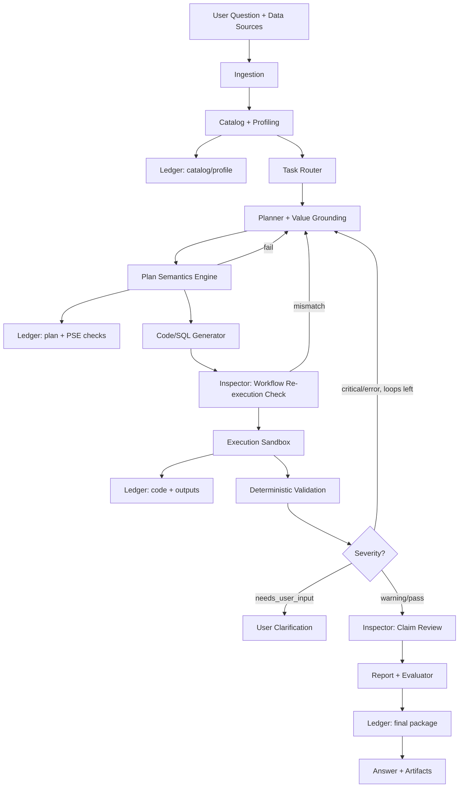

# Data-Agent-Lab Project Design

Version: 0.3  
Date: 2026-06-14  
Status: MVP design updated with literature-driven Plan Semantics Engine; implementation not started.

## Changelog

### 0.3 (2026-06-14)

- Added literature synthesis from DataAgentBench (2026), AIRepr, IDA-Bench, Data Interpreter, QJoin.
- Identified dominant failure gap: plan semantics (FM2) + implementation (FM4) = 85% of DAB errors.
- Added **Plan Semantics Engine (PSE)** as Core module: grain verifier, structured field extractor, workflow re-execution check.
- Moved structured text-field parsing from implicit to explicit Core capability.
- Added golden tasks for aggregation-grain traps and text-field extraction.

### 0.2 (2026-06-14)

- Split MVP into Core / Stretch / Deferred tiers.
- Vertical delivery slices S0–S5; incremental Evidence Ledger.
- Revision policy, value grounding, LLM strategy, sandbox security.
- North-star metrics with numeric targets.

### 0.1 (2026-06-13)

- Initial MVP design lock.

## 0. Executive Summary

Data-Agent-Lab is a **verification-native data analysis agent** for local CSV and SQL data. It is not a chatbot that happens to run SQL; it is a reproducible analysis workbench that treats every answer as a claim requiring evidence.

**North-star metrics for MVP Core:**

| Metric | Target |
| --- | --- |
| Golden-task pass rate (Core tier) | >= 70% |
| Reproducibility pass rate on rerun | >= 90% |
| Runs with critical validation suppressed | 0% |
| Median end-to-end runtime (single-table task) | < 90s |
| Artifact completeness (required files present) | 100% |

**Delivery strategy:** Ship five vertical slices. Each slice delivers a runnable end-to-end path for one task family before expanding breadth. Avoid building all modules horizontally before the first demo works.

**MVP Core promise:** Load local CSV/SQLite/DuckDB data, answer descriptive and data-quality questions, validate results deterministically, and export a reproducible report package.

## 1. One-Line Vision

A data analysis agent that reads CSV and SQL databases, writes Python and SQL, validates results, and generates reproducible reports.

## 2. Product Thesis

Most data agents fail not because they cannot generate SQL or pandas code, but because they do not know when their answer is unreliable.

Data-Agent-Lab should therefore be designed as a verification-native data analysis agent:

- It treats every result as a claim that needs evidence.
- It records how each answer was produced.
- It generates tests or evaluators for the task.
- It makes data quality problems visible instead of hiding them behind fluent explanations.

The MVP should optimize for correctness, reproducibility, and auditability before broad connector support or flashy UI.

### 2.1 Competitive Positioning

| Dimension | Typical chat-based data tools | Data-Agent-Lab |
| --- | --- | --- |
| Output | Natural-language answer | Answer + code + validation log + evaluator |
| Trust model | Fluency | Deterministic checks + evidence citations |
| Reproducibility | Optional export | Required artifact package per run |
| Data quality | Often hidden | Surfaced as warnings/errors in report |
| Evaluation | Manual review | Golden tasks + structural evaluators |

## 3. Research Context

### 3.1 DataAgentBench

UC Berkeley EPIC Data Lab and Hasura/PromptQL released DataAgentBench, a benchmark for realistic enterprise data agent tasks.

Key takeaways:

- It evaluates complex data tasks instead of isolated text-to-SQL.
- It includes 54 queries across 12 datasets, 9 domains, and 4 database systems: PostgreSQL, MongoDB, SQLite, and DuckDB.
- It stresses multi-database integration, ill-formatted join keys, unstructured text transformation, and domain knowledge.
- The paper reports that the best frontier model in their experiments achieved only 38% pass@1, showing that this category is far from solved.

Reference:

- https://ucbepic.github.io/DataAgentBench/
- https://github.com/ucbepic/DataAgentBench
- https://arxiv.org/abs/2603.20576

### 3.2 Related Benchmarks and Systems

Data Interpreter shows that data science agents benefit from dynamic planning, hierarchical task graphs, tool integration, and logical inconsistency detection.

Reference: https://arxiv.org/abs/2402.18679

AIRepr proposes an Analyst-Inspector framework for improving reproducibility of LLM-generated data science workflows. This supports our decision to separate answer generation from answer inspection.

Reference: https://arxiv.org/abs/2502.16395

IDA-Bench evaluates multi-round interactive data analysis, which reflects real workflows better than one-shot questions.

Reference: https://arxiv.org/abs/2505.18223

BIRD focuses on large-scale database-grounded text-to-SQL with dirty database values, external knowledge, and SQL efficiency. This reinforces the need for value grounding and schema-aware SQL generation.

Reference:

- https://arxiv.org/abs/2305.03111
- https://bird-bench.github.io/

InfiAgent-DABench and DataSciBench show that data analysis evaluation needs closed-form checks, task-level metrics, and broader data science workflows.

References:

- https://arxiv.org/html/2401.05507v1
- https://datascibench.github.io/

### 3.3 Framework Implications

LangGraph is a strong default for MVP orchestration because the agent needs state, checkpointing, durable execution, streaming, and human-in-the-loop interruption.

Reference: https://docs.langchain.com/oss/python/langgraph/overview

OpenAI Agents SDK is attractive for later integration because it has tool calling, tracing, guardrails, handoffs, and MCP integration.

References:

- https://developers.openai.com/api/docs/guides/agents
- https://openai.github.io/openai-agents-python/tracing/

Pandera is a good first validation library because it provides code-native DataFrame schemas and supports pandas-style validation.

Reference: https://pandera.readthedocs.io/

### 3.4 Literature Synthesis (2024–2026)

| Paper | Year | Key result | Actionable method | Implication for this project |
| --- | --- | --- | --- | --- |
| [DataAgentBench](https://arxiv.org/abs/2603.20576) | 2026 | 38% pass@1 best model | FM1–FM5 failure taxonomy on 54 enterprise queries | Primary benchmark; FM2+FM4 dominate failures |
| [AIRepr](https://arxiv.org/abs/2502.16395) | 2025 | Reproducibility correlates with accuracy | Analyst–Inspector + RReflexion re-execution | Add blind workflow re-execution in Inspector |
| [IDA-Bench](https://arxiv.org/abs/2505.18223) | 2025 | SOTA agents < 50% on multi-round tasks | LLM-simulated evolving user instructions | Deferred: session state after Core |
| [Data Interpreter](https://arxiv.org/abs/2402.18679) | 2025 | 75.9% → 94.9% on InfiAgent-DABench | Hierarchical task/action graph + node verification | Plan as machine-readable DAG, step checks |
| [InfiAgent-DABench](https://arxiv.org/abs/2401.05507) | 2024 | 603 closed-form CSV questions | Format-prompting for auto-eval | Stage-2 benchmark adapter |
| [DS-Agent](https://arxiv.org/abs/2402.17453) | 2024 | 36% one-pass improvement | Case-based reasoning from Kaggle cases | Deferred: solved-run case bank |
| [BIRD](https://arxiv.org/abs/2305.03111) | 2023 | Dirty values break text-to-SQL | Value grounding against DB contents | Already in v0.2 value grounding |
| [QJoin](https://arxiv.org/html/2512.02444) | 2025 | 91% F1 join discovery | Learned transformation chains | Stretch upgrade for dirty join resolver |

### 3.5 Dominant Failure Gap (from DataAgentBench)

DataAgentBench annotates 1,147 incorrect agent trajectories across five frontier LLMs. The distribution among completed-but-wrong runs:

| Failure mode | Share | Description | Example |
| --- | --- | --- | --- |
| **FM4 Incorrect implementation** | **45%** | Right plan and data, wrong code | Regex extracts ISBN digits as publication year |
| **FM2 Incorrect plan** | **40%** | Wrong computation structure | Averages book-level averages instead of all reviews |
| FM3 Incorrect data selection | 15% | Wrong table/column | Checks `description` instead of `details` for language |
| FM1 Refused / no attempt | ~0% | Agent gives up without tools | — |

**Takeaway:** Agents usually pick the right data (FM3 is rare). The dominant weakness is **what to compute** and **how to compute it**. A second DAB takeaway: all evaluated agents default to regex for unstructured text fields; patents dataset scores **0% pass@1** because date parsing requires structured extractors, not regex alone.

**v0.2 gap:** Value grounding targets FM3 (15%). Dirty join resolver targets multi-DB integration (Stretch). Neither addresses the 85% FM2+FM4 block.

**v0.3 fix:** Add **Plan Semantics Engine (PSE)** to Core (Section 5.8).

## 4. Project Positioning

### 4.1 Target User

Primary user:

- Analyst, data scientist, product manager, or founder who has data files or local databases and wants trustworthy analysis without hand-writing every query.

Secondary user:

- Engineer evaluating whether data agents can be trusted on realistic, messy datasets.

### 4.2 Core User Flow

1. User uploads or connects data.
2. User asks a natural-language question.
3. Agent profiles available data and writes catalog/profile snapshots to the run ledger.
4. Agent creates an analysis plan with expected result shape, **operation DAG**, and validation checks.
5. **Plan Semantics Engine validates grain, operations, and text-field extraction strategy before code generation.**
6. Agent writes SQL or Python.
7. Agent executes code in a read-only sandbox.
8. Agent runs deterministic validators on data, query, and result artifacts.
9. **Inspector performs workflow re-execution check and reviews artifacts for unsupported claims.**
10. If validation fails, agent revises up to a bounded number of times or escalates to the user.
11. Agent returns answer, code, charts, validation log, evaluator, and reproducibility package.

### 4.3 Example Questions

**MVP Core:**

- What is monthly revenue by product category?
- Which columns have more than 10% null values?
- Find duplicate customer records by email.
- Which month had the largest revenue drop?
- Extract publication year from a free-text metadata column (structured field extraction).

**MVP Stretch:**

- Which customer segment has the highest churn risk?
- Run regression and explain key drivers.
- Compare retention before and after a pricing change.
- Find rows that fail expected business constraints.

### 4.4 Non-Goals for MVP

The MVP should not attempt:

- Production multi-tenant deployment.
- Write access to user databases.
- Full BI dashboard replacement.
- Fully autonomous long-running business decisions.
- MongoDB/PostgreSQL connectors before CSV, SQLite, and DuckDB are reliable.
- Advanced document understanding before structured-data workflows are stable.

## 5. Key Innovation Points

### 5.1 Verification-Native Agent Loop

Every generated answer must pass explicit checks before it is presented as reliable.

Validation layers:

- Data validation: schema, row count, nulls, duplicates, type inference, date parsing, range checks.
- Query validation: selected tables, join keys, row-loss analysis, aggregation grain, filter sanity.
- Statistical validation: sample size, missingness, multicollinearity, regression diagnostics, confidence intervals.
- Result validation: expected shape, non-empty result, plausible ranges, stable ranking, sensitivity checks.
- Claim validation: final explanation must cite computed artifacts and cannot introduce unsupported claims.

**Revision policy:**

- Max 3 planner revision loops per run.
- `critical` failures block final answer emission.
- `error` failures trigger revision; after loop 3, status becomes `needs_user_input`.
- `warning` failures allow answer output with mandatory caveats.
- Every revision appends to `plan_versions` and the evidence ledger.

### 5.2 Evidence Ledger

Each task run produces a durable evidence ledger. The ledger is **incremental**, not assembled only at the end.

Write points:

- Run start: question, data manifest, run metadata.
- After profiling: catalog/profile snapshots and fingerprints.
- After planning: plan version and declared validators.
- After execution: code paths, stdout/stderr, output summaries.
- After validation: validation log and severity summary.
- After reporting: final answer, evaluator, reproduction command.

This is the main differentiator from chat-only data tools.

### 5.3 Analyst-Inspector Architecture

The agent is split into two logical roles:

- Analyst: proposes plan, writes SQL/Python, interprets results.
- Inspector: checks data assumptions, validates code/result quality, challenges unsupported conclusions, generates evaluator checks.

The first implementation can use one model with different prompts. The architecture should still preserve role separation in code and logs.

Inspector runs **after execution and before report generation**, not as an optional post-step.

### 5.4 Value Grounding Before Code Generation

Inspired by BIRD and DataAgentBench, the planner must ground filters, join keys, and categorical values against profiled sample values before generating SQL or Python.

Minimum grounding artifacts in `plan.vN.json`:

- Selected tables and columns with profile references.
- Filter values matched against observed distinct values or normalized variants.
- Join keys with expected overlap rate from profiling.
- Time range mapped to observed min/max datetime columns.

This reduces hallucinated filter values and impossible join assumptions.

### 5.5 Dirty Join Key Resolver

Real enterprise data often has inconsistent join keys.

The resolver should:

- Detect candidate join columns using names, types, value overlap, and uniqueness.
- Normalize text keys through casing, whitespace, punctuation, accents, abbreviations, and date formats.
- Estimate join quality before and after normalization.
- Report unmatched rates by side.
- Support fuzzy matching only when confidence is high enough.
- Log ambiguous matches instead of silently accepting them.

**Scope note:** Dirty join resolver is MVP Stretch. Core supports explicit join keys with join-loss validation only.

### 5.8 Plan Semantics Engine (PSE) — Core, literature-driven

The weakest pain point across frontier data agents is not data selection but **plan semantics and implementation strategy**. PSE is a deterministic pre-execution and post-plan module that closes the FM2+FM4 gap identified by DataAgentBench.

PSE has three sub-modules:

#### 5.8.1 Grain and Operation Verifier

Runs on `plan.vN.json` **before** code generation.

Checks:

- **Aggregation grain:** row-level vs group-level vs nested aggregation; block avg-of-avgs when question requires global aggregate (DAB FM2 example).
- **Operation completeness:** every requirement in the parsed question maps to a plan step; no missing filters or post-conditions.
- **Forbidden shortcuts:** `LIMIT` without explicit sampling justification; premature truncation when question requires full table scan.
- **Result shape contract:** expected columns, sort order, and cardinality declared in plan match question intent.

Outputs: `validation/plan_semantics.json` with pass/fail per check and revision hints for the planner.

Inspired by Data Interpreter's hierarchical task graph verification and DAB FM2 taxonomy.

#### 5.8.2 Structured Field Extractor (SFE)

Runs during planning when profile marks a column as **unstructured text** (high entropy, mixed formats, embedded dates/IDs in prose).

Routing logic (never default to bare regex):

| Profile signal | Parser route | Example |
| --- | --- | --- |
| Date-like tokens in samples | `dateutil` + format voting on sample rows | "5th March 2019", "March the 18th, 2019" |
| Numeric ID embedded in prose | Anchored pattern + cross-check against known ID columns | ISBN segments vs year |
| Categorical tokens in free text | Token overlap against profiled distinct values | "MALE" inside "FEMALE" → negative lookahead |
| No rule match above confidence | LLM extraction on sample batch + holdout verification | Patents-style varied formats |

Each extraction step declares: source column, parser type, sample validation rate, and fallback policy. Failed sample validation blocks code generation with `error` severity.

This directly addresses DAB's finding that regex-only extraction causes 0% pass@1 on patents and systematic errors on bookreview/pancancer_atlas.

#### 5.8.3 Workflow Re-execution Check (AIRepr-inspired)

After code generation, before sandbox execution, the Inspector receives:

- Machine-readable plan JSON only (no Analyst code).
- Minimal schema summary (table/column names, no full profile dump).

Inspector generates an equivalent computation skeleton (SQL outline or pandas step list). A structural diff against the Analyst's plan checks:

- Same aggregation grain.
- Same filter predicates (grounded values).
- Same extraction steps for unstructured fields.

Mismatch triggers revision without executing potentially wrong code. This implements AIRepr's core insight: if the workflow cannot be re-derived, it is not reproducible and likely wrong.

**PSE placement in pipeline:** Profile → Plan → **PSE** → Code → Sandbox → Result validation → Inspector claim check → Report.

**PSE is Core, not Stretch.** Without it, the project over-invests in FM3 mitigations while 85% of real-world agent failures remain unaddressed.

### 5.6 Auto-Evaluator Generation

For every completed task, the system should generate a small task-specific evaluator.

Examples:

- `pytest` checks that required output files exist.
- Assert the result table has expected columns.
- Assert row counts are within expected bounds.
- Assert a top-ranked segment remains the same under rerun.
- Assert numeric outputs are within tolerance.
- Assert no validation check marked critical failure.

The evaluator is not just for CI. It is part of the answer artifact.

**Evaluator design rule:** structural checks first, numeric assertions second, semantic LLM checks never as the only gate.

### 5.7 Reproducible Report Package

Every answer should be exportable as a reproducible package:

- Markdown report.
- Executed code.
- SQL queries.
- Chart files.
- Validation log.
- Data fingerprints.
- Evaluator tests.
- Minimal run metadata.

## 6. MVP Scope

### 6.1 Tiering

| Tier | Scope | Release gate |
| --- | --- | --- |
| **Core** | CSV folder, SQLite, DuckDB; descriptive + data-quality tasks; deterministic validation; Markdown report; pytest evaluator; CLI | Slice S3 complete |
| **Stretch** | Anomaly detection, basic regression, dirty join resolver, HTML report, Streamlit UI | Slice S5 complete |
| **Deferred** | PostgreSQL, MongoDB, cloud warehouses, PDF extraction, multi-DB orchestration | Post-MVP |

### 6.2 Supported Inputs

MVP Core supports:

- CSV files.
- SQLite databases.
- DuckDB databases.
- Local folders containing multiple CSV files.

MVP defers:

- PostgreSQL.
- MongoDB.
- Cloud warehouses.
- Live credentials.
- PDF/document extraction.

### 6.3 Supported Tools

MVP tools:

- DuckDB for SQL over CSV, Parquet if available, SQLite imports, and local analytical queries.
- pandas for DataFrame operations.
- plotly for interactive charts (Stretch).
- statsmodels for regression (Stretch).
- pytest for evaluator checks.
- Streamlit for local UI (Stretch).

Validation libraries:

- Pandera for DataFrame checks in MVP Core.
- Great Expectations later if richer data documentation and cross-backend validation become necessary.

### 6.4 Supported Task Types

**MVP Core:**

1. Descriptive analytics: grouped aggregation, ranking, trends.
2. Data quality analysis: nulls, duplicates, type mismatches, broken joins with explicit keys.

**MVP Stretch:**

3. Anomaly detection: month-over-month changes, z-score checks, segment shifts.
4. Basic statistical modeling: linear/logistic regression, feature importance, diagnostic warnings.

## 7. System Architecture



### 7.1 Modules

#### Ingestion Layer

Responsibilities:

- Load CSV, SQLite, and DuckDB sources.
- Register tables in DuckDB.
- Infer schema.
- Store dataset fingerprints.
- Create a catalog of tables, columns, types, and sample values.

Outputs: `catalog.json`, `profile.json`, registered DuckDB connection.

#### Profiling Layer

Responsibilities:

- Row count, column count, data types.
- Null count/ratio, unique count.
- Numeric min/max/mean/median/std.
- Categorical top values, datetime ranges.
- Duplicate row count.
- Candidate primary keys and foreign/join keys.

Profiles should be cached by dataset fingerprint. Re-profile only when fingerprint changes.

#### Task Router

Responsibilities:

- Classify task type and choose initial tool set.
- Decide whether the question needs clarification.
- Reject out-of-scope requests early with explicit reason.

Clarification should be used sparingly. If a reasonable default can be stated and validated, proceed.

#### Planner

Responsibilities:

- Create a compact, machine-readable analysis plan.
- Select tables/columns with profile references.
- Define expected result shape and validators before code generation.
- Decide whether SQL, pandas, or statsmodels is primary.

#### Code/SQL Generator

Responsibilities:

- Generate executable SQL and Python.
- Avoid hidden state; use named output files.
- Include deterministic seeds for stochastic steps.
- Use explicit data types and date parsing when needed.

#### Execution Sandbox

Responsibilities:

- Execute generated SQL/Python in a controlled local environment.
- Capture stdout, stderr, exceptions, runtime, and produced artifacts.
- Restrict database operations to read-only for user data.
- Write outputs only to the task run directory.

See Section 7.2 for sandbox requirements.

#### Validation Engine

Responsibilities:

- Run pre-defined and task-specific validators.
- Produce severity levels: `info`, `warning`, `error`, `critical`.
- Send failed runs back to planner with concrete, machine-readable feedback.

Validation should be deterministic first. LLM inspection is useful only after deterministic checks.

#### Report Generator

Responsibilities:

- Generate Markdown (Core) and optional HTML (Stretch).
- Include answer, method, assumptions, charts, code, SQL, validation summary.
- Distinguish computed facts from interpretation.
- Include caveats when validation warnings remain.

#### Evaluator Generator

Responsibilities:

- Generate `pytest` checks or a JSON evaluator spec.
- Make completed tasks rerunnable with structural checks first.

#### Evidence Ledger

Responsibilities:

- Persist all run artifacts incrementally.
- Enable replay, debugging, and benchmark traceability.

### 7.2 Sandbox Security (MVP)

Minimum requirements for local MVP:

- Execute generated code in a subprocess with timeout (default 120s).
- Deny network access during execution.
- Allow reads from registered data paths and writes only under `runs/{run_id}/`.
- Block SQL write/DDL keywords against user sources.
- Capture full stdout/stderr and exit code.
- Optional Stretch upgrade: containerized sandbox if subprocess isolation is insufficient.

Not locked yet: exact timeout values, container runtime choice.

### 7.3 LLM Strategy

Principles:

- Use a **single primary model** for Analyst and Inspector in MVP Core.
- Keep provider behind an internal `LLMClient` interface.
- Pass compact profile snippets, not full datasets, to the model.
- Cache catalog/profile summaries by fingerprint within a session.
- Log prompt version, model name, token usage, and latency per node.

Suggested routing:

| Node | Input context | Notes |
| --- | --- | --- |
| Task Router | Question + catalog summary | Small, classification-only |
| Planner | Question + grounded profile slices | Must output JSON plan |
| Code Generator | Plan + schema + sample values | Low temperature |
| Inspector | Artifacts + validation log | Separate prompt, can use same model |
| Report Writer | Validated artifacts only | No new computations |

Cost guardrails:

- Hard cap on revision loops (3).
- Truncate profile payloads to top-N values per column.
- Fail fast on execution errors before LLM-heavy report generation.

## 8. Proposed Repository Structure

```text
Data-Agent-Lab/
  docs/
    PROJECT_DESIGN.md
    PROJECT_DESIGN.zh-CN.md
    ARCHITECTURE.md
    EVALUATION_STRATEGY.md
  data_agent_lab/
    benchmarks/
      base.py
      runner.py
      registry.py
      evaluators.py
      adapters/
        golden.py
        infiagent_dabench.py
        data_agent_bench.py
    cli/
      main.py
    __init__.py
    config.py
    catalog/
      ingestion.py
      profiler.py
      schema.py
      fingerprints.py
    agents/
      graph.py
      prompts.py
      analyst.py
      inspector.py
      planner.py
      llm_client.py
    tools/
      sql.py
      python_exec.py
      plotting.py
      stats.py
    validation/
      data_checks.py
      query_checks.py
      stats_checks.py
      claim_checks.py
      plan_semantics.py
      field_extractor.py
      evaluator_writer.py
    reporting/
      markdown.py
      html.py
      ledger.py
    runtime/
      sandbox.py
      artifacts.py
    ui/
      streamlit_app.py
  tests/
    unit/
    golden/
  examples/
    csv_revenue/
    csv_quality/
    sqlite_revenue/
  runs/
    .gitkeep
  pyproject.toml
  README.md
```

Add `runtime/` for sandbox and artifact management. Create structure incrementally per vertical slice, not all at once.

## 9. Run Artifact Layout

Each run should produce:

```text
runs/{run_id}/
  input/
    question.txt
    data_manifest.json
  catalog/
    catalog.json
    profile.json
  plan/
    plan.v1.json
    plan.final.json
    plan_semantics.json
  code/
    analysis.py
    queries.sql
  outputs/
    result.csv
    figures/
      chart_001.html
      chart_001.png
  validation/
    validation_log.json
    validation_summary.md
  report/
    report.md
    report.html
  evaluator/
    test_task.py
    evaluator.json
  ledger.json
  meta.json
```

`meta.json` stores model name, prompt versions, revision count, runtime, and token usage.

## 10. Validation Design

### 10.1 Validation Severity

| Level | Meaning | Action |
| --- | --- | --- |
| `info` | Useful metadata | Continue |
| `warning` | Possible issue | Continue with caveat |
| `error` | Likely unreliable | Revise or ask user |
| `critical` | Must not ship | Block final answer |

### 10.2 Baseline Checks

Dataset, SQL, Python, statistical, and report checks remain as defined in v0.1. Core additions:

- Plan-to-code consistency: generated SQL/Python must reference only tables/columns declared in the active plan.
- **Plan semantics:** aggregation grain, operation completeness, no unjustified LIMIT (PSE §5.8.1).
- **Field extraction:** declared parser type must match profile routing; sample validation rate above threshold (PSE §5.8.2).
- **Workflow re-execution:** Inspector skeleton grain matches Analyst plan (PSE §5.8.3).

## 11. Agent State Contract

Core state fields:

```yaml
run_id: string
question: string
data_sources: list
catalog_path: string
profile_path: string
task_type: string
plan_versions: list
revision_count: int
selected_tools: list
code_paths: list
execution_results: list
validation_results: list
artifacts: list
final_report_path: string
evaluator_path: string
status: pending | running | needs_revision | needs_user_input | completed | failed
ledger_path: string
```

## 12. Agent Orchestration Decision

Use LangGraph as the first orchestration layer.

Reasoning:

- Graph-shaped workflow with conditional revision routing.
- Durable state and replay for reproducibility.
- Human clarification as interrupt.

Keep ingestion, profiling, validation, reporting, and sandbox behind framework-independent interfaces so OpenAI Agents SDK can be added later.

## 13. UI Design Principles

MVP Core is CLI-first. Streamlit workbench is Stretch.

When UI ships, it should be a workbench that exposes warnings, row counts, join loss, generated code, and reproducibility status near the final answer.

## 14. Evaluation Strategy

### 14.1 Golden Tasks (start at M1)

Build golden tasks incrementally alongside features.

| Slice | Golden tasks to add |
| --- | --- |
| S1 | Profiling snapshot tests (3 datasets) |
| S2 | Single-table aggregation, null/duplicate profile, **avg-of-avgs grain trap** |
| S3 | Multi-table join + join-loss, broken join detection, **text-field year extraction** |
| S4 | Anomaly task, regression task with diagnostics |
| S5 | End-to-end UI smoke task |

Target: 12 Core golden tasks before external benchmarks.

Each golden task includes input data, question, evaluator, expected artifacts, and known failure modes.

### 14.2 Metrics

Core metrics: answer correctness, reproducibility pass rate, validation pass rate, artifact completeness, revision loops, runtime, token cost, clarification count.

Reliability metrics: unsupported claim rate, silent data-quality failure rate, broken join detection rate, evaluator pass rate on rerun, **plan semantics pass rate**, **field extraction sample validation rate**.

### 14.3 Benchmark Path

Benchmark adapters ship **in parallel** with agent slices (see [EVALUATION_STRATEGY.md](./EVALUATION_STRATEGY.md)).

| Stage | Adapter CLI | Gate |
| --- | --- | --- |
| 1 | `golden` | Core golden >= 70% |
| 2 | `infiagent` | Core gate + manifest |
| 3 | DataSciBench-style | TBD |
| 4 | `dab` (SQLite/DuckDB subset) | S3 Core complete |
| 5 | `dab` full | PostgreSQL/MongoDB |

Do not start stage 4 DAB runs before Core golden tasks reach >= 70% pass rate.

Implementation (S0 done): `data_agent_lab/benchmarks/`, `dal bench list|run|report|export`.

## 15. Delivery Slices (Optimized Milestones)

Replace horizontal module milestones with vertical slices. Each slice is demoable and testable on its own.

### S0: Design Lock (was M0)

Deliverables: design docs, architecture outline, first 3 golden profiling fixtures, **benchmark adapter framework (`golden`, `infiagent`, `dab`)**.

Exit: MVP tiers documented; Slice S1 tasks are unblocked; `dal bench run --adapter golden --agent stub` passes.

### S1: Trustworthy Profiling Pipeline (was M1)

Deliverables: ingestion, profiler, fingerprints, incremental ledger writes for catalog/profile, CLI `profile` command.

Exit: sample dataset profiles to JSON; golden profiling tests pass; fingerprint cache works.

### S2: Single-Table Analysis Loop (was M2 partial)

Deliverables: planner schema, value grounding, **Plan Semantics Engine (grain verifier)**, DuckDB SQL execution, subprocess sandbox, basic validators, Markdown report.

Exit: one descriptive question produces answer, SQL, validation log, and report; **avg-of-avgs grain trap is caught by PSE before execution**; execution failures captured cleanly.

### S3: Verified Multi-Table Core (was M2 + M3 Core)

Deliverables: join-loss validation, revision loop, **Structured Field Extractor**, **workflow re-execution check**, Inspector claim review, pytest evaluator, reproducible package export, CLI `analyze`.

Exit: multi-table golden tasks pass; **text-field extraction golden task passes**; critical failures block answer; rerun reproduces artifacts.

**This is the MVP Core release gate.**

### S4: Stretch Analytics

Deliverables: anomaly detection, statsmodels regression, stats validators, dirty join resolver, HTML report.

Exit: Stretch golden tasks pass; join normalization logs ambiguous matches.

### S5: Workbench and Benchmark Runner (was M5 + M6)

Deliverables: Streamlit UI, **`dal analyze` wired as benchmark AgentFn**, infiagent manifest tooling, DAB subset submission export.

Exit: full task runnable without CLI; golden + external subset metrics reported via `dal bench report`.

## 16. Risk Register

| Risk | Mitigation |
| --- | --- |
| Fluent but wrong answers | Validation-first workflow, claim verification, block critical failures |
| Dirty joins produce false conclusions | Join-loss checks in Core; normalization module in Stretch |
| Evaluators overfit wrong answers | Structural checks first; Inspector reviews evaluator |
| Framework lock-in | Framework-independent core modules; orchestration adapter boundary |
| UI hides uncertainty | CLI/report caveats in Core; explicit warning panels in Stretch UI |
| Benchmark chasing weakens product | Separate product golden tasks from external benchmark adapters |
| Unbounded revision loops | Max 3 loops, then `needs_user_input` |
| LLM cost/latency blowup | Profile truncation, fail-fast execution, single primary model |
| FM2/FM4 plan and implementation errors | Plan Semantics Engine: grain verifier, field extractor, workflow re-execution |

## 17. Implementation Backlog (Vertical Order)

**S0**

- Package skeleton, `pyproject.toml`, CI test harness.
- Golden fixture: `examples/csv_revenue/`.
- **Benchmark adapters + `dal bench` CLI (parallel track).**

**S1**

- CSV/SQLite/DuckDB ingestion, profiler, fingerprints.
- `runtime/artifacts.py`, ledger write helpers.
- CLI: `dal profile <path>`.

**S2**

- Planner JSON schema, value grounding, **plan_semantics.py (grain verifier)**, SQL tool, sandbox, data/query validators.
- Markdown report generator.
- CLI: `dal analyze --question ...`.
- Golden task: avg-of-avgs trap.

**S3**

- **field_extractor.py**, workflow re-execution in Inspector, revision routing, claim checks, evaluator writer.
- Multi-table golden tasks, **text-field extraction golden task**, reproducibility command.

**S4**

- Anomaly + regression modules, dirty join resolver, HTML report.

**S5**

- Streamlit workbench, benchmark runner.

## 18. Design Decisions

Locked:

- CSV, SQLite, DuckDB for MVP Core.
- Python, DuckDB, pandas, pytest, Pandera, LangGraph.
- CLI-first Core; Streamlit in Stretch.
- Incremental evidence ledger and bounded revision loops.
- Verification and reproducibility as first-class artifacts.
- **Plan Semantics Engine as Core module (PSE §5.8).**

Not locked:

- Exact LLM provider and model.
- Subprocess vs container sandbox.
- Markdown-only vs Markdown+HTML in Stretch.
- External benchmark integration order.

## 19. First Build Slice

The smallest meaningful build slice (S2 target):

1. Load a folder of CSV files.
2. Generate `catalog.json` and `profile.json`.
3. Ask one descriptive question.
4. Produce a grounded plan in `plan.v1.json`.
5. **Run PSE grain verifier; block execution on plan semantics failure.**
6. Generate and execute SQL through DuckDB in a sandbox.
7. Validate row count, null profile, selected columns, and result shape.
8. Write incremental ledger entries including `plan_semantics.json`.
9. Output `report.md`, `queries.sql`, `validation_log.json`, and `test_task.py`.

**Acceptance criteria:**

- Rerun with the same inputs produces byte-stable SQL and equivalent result CSV.
- Injecting a wrong column name causes validation failure and one revision attempt.
- **Injecting an avg-of-avgs plan is caught by PSE before sandbox execution.**
- No files written outside `runs/{run_id}/`.

## 20. Success Definition

MVP Core is successful when:

- A user can ask descriptive and data-quality questions over local CSV/SQLite/DuckDB data via CLI.
- The agent returns an answer with code, validation log, evaluator, and reproducibility package.
- Critical validation failures never ship as confident answers.
- >= 70% of Core golden tasks pass; >= 90% reproducibility on rerun.
- **PSE catches >= 90% of injected FM2 grain-trap plans before execution.**
- Data quality issues are surfaced clearly instead of hidden.

Stretch success adds anomaly/regression tasks, dirty join handling, and a local workbench UI.

The project should feel less like a chatbot and more like a junior analyst who leaves behind a clean notebook, a test file, and a transparent audit trail.
