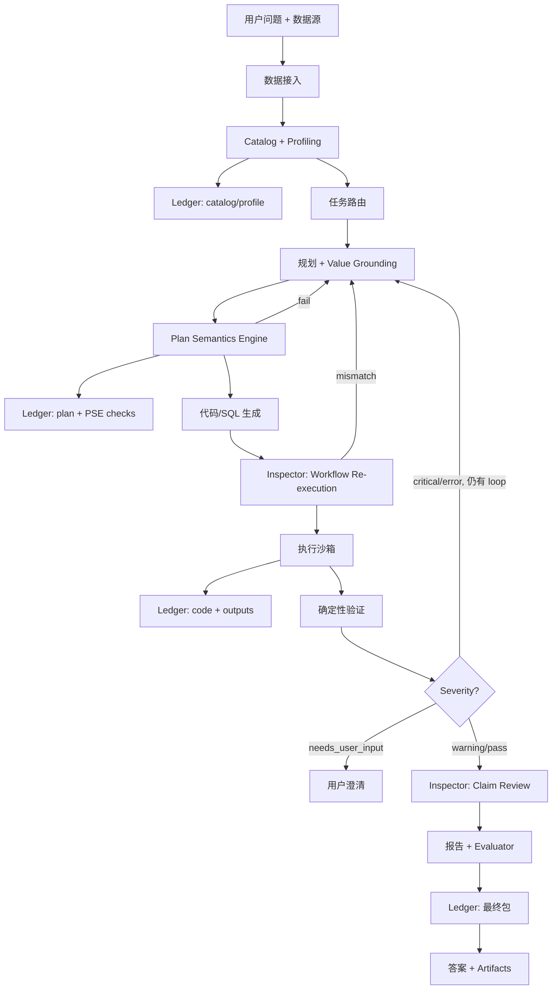

# Data-Agent-Lab 项目设计

版本：0.3  
日期：2026-06-14  
状态：已基于最新论文补充 Plan Semantics Engine；尚未开始实现。

## 版本变更

### 0.3（2026-06-14）

- 补充 DataAgentBench（2026）、AIRepr、IDA-Bench、Data Interpreter、QJoin 等文献综述。
- 识别主导失败模式：计划语义错误（FM2）+ 实现错误（FM4）占 DAB 错误 85%。
- 新增 **Plan Semantics Engine (PSE)** 作为 Core 模块。
- 将结构化文本字段解析从隐式能力改为显式 Core 能力。

### 0.2 / 0.1

- 见英文版 Changelog。

## 0. 执行摘要

Data-Agent-Lab 是一个面向本地 CSV/SQL 数据的 **验证原生数据分析 agent**。它不是"能跑 SQL 的聊天机器人"，而是一个把每个答案都当作需要证据支持的 claim、并强制产出可复现分析包的工作台。

**MVP Core 北极星指标：**

| 指标 | 目标 |
| --- | --- |
| Golden task 通过率（Core 层） | >= 70% |
| Rerun 可复现通过率 | >= 90% |
| 出现 critical 验证仍输出"有效答案"的比例 | 0% |
| 单表任务端到端耗时中位数 | < 90s |
| 必需 artifact 完整率 | 100% |

**交付策略：** 按 5 个垂直切片推进。每个切片先打通某一类任务的全链路，再扩展广度。避免所有模块横向做完才做第一次 demo。

**MVP Core 承诺：** 加载本地 CSV/SQLite/DuckDB，回答描述性与数据质量问题，做确定性验证，导出可复现报告包。

## 1. 一句话愿景

构建一个能自动完成数据分析任务的 agent：读取 CSV 和 SQL 数据库，编写 Python/SQL，验证结果，并生成可复现报告。

英文定位：

> A data analysis agent that reads CSV/SQL databases, writes Python/SQL, validates results, and generates reproducible reports.

## 2. 产品命题

很多 data agent 的核心问题不是不会写 SQL 或 pandas 代码，而是它们不知道自己的答案什么时候不可靠。

因此，Data-Agent-Lab 的核心定位不是"会聊天的数据分析助手"，而是一个 **验证原生、复现优先** 的数据分析 agent。

它应该做到：

- 把每个分析结论都视为需要证据支持的 claim。
- 记录每个答案是如何产生的。
- 为每个任务生成测试或 evaluator。
- 明确暴露数据质量问题，而不是用流畅解释把不确定性盖过去。

MVP 的优先级应该是：正确性、可复现性、可审计性，先于广泛数据源接入和复杂 UI。

### 2.1 竞争定位

| 维度 | 典型 chat-based 数据工具 | Data-Agent-Lab |
| --- | --- | --- |
| 输出 | 自然语言答案 | 答案 + 代码 + 验证日志 + evaluator |
| 信任模型 | 流畅度 | 确定性检查 + 证据引用 |
| 可复现性 | 可选导出 | 每次 run 强制 artifact 包 |
| 数据质量 | 常被隐藏 | 以 warning/error 形式写入报告 |
| 评测 | 人工 review | Golden tasks + 结构性 evaluator |

## 3. 研究背景

### 3.1 DataAgentBench

UC Berkeley EPIC Data Lab 和 Hasura/PromptQL 发布的 DataAgentBench 是目前最贴近本项目方向的 benchmark。

关键启发：

- 评估重点是复杂数据分析任务，而不是孤立 SQL 生成。
- 覆盖 54 个 query、12 个 dataset、9 个领域、4 类数据库系统。
- 难点包括多数据库整合、脏 join key、非结构化文本转换、领域知识。
- 最佳 frontier model pass@1 仅 38%，说明可靠 data agent 远未被解决。

参考：

- https://ucbepic.github.io/DataAgentBench/
- https://github.com/ucbepic/DataAgentBench
- https://arxiv.org/abs/2603.20576

### 3.2 相关 benchmark 和系统

Data Interpreter、AIRepr、IDA-Bench、BIRD、InfiAgent-DABench、DataSciBench 等工作的启发已纳入本方案：动态规划、Analyst-Inspector 分离、多轮交互、value grounding、closed-form checks。

### 3.3 框架启发

MVP 编排层推荐 LangGraph；OpenAI Agents SDK 作为后续 adapter；Pandera 作为 MVP Core 的 DataFrame 验证库。

### 3.4 文献综述（2024–2026）

| 论文 | 年份 | 核心结果 | 可借鉴方法 | 对本项目的启示 |
| --- | --- | --- | --- | --- |
| [DataAgentBench](https://arxiv.org/abs/2603.20576) | 2026 | 最佳模型 pass@1 仅 38% | FM1–FM5 失败分类 | 主 benchmark；FM2+FM4 占主导 |
| [AIRepr](https://arxiv.org/abs/2502.16395) | 2025 | 可复现性与准确率正相关 | Analyst–Inspector + RReflexion | Inspector 增加 blind re-execution |
| [IDA-Bench](https://arxiv.org/abs/2505.18223) | 2025 | SOTA agent 成功率 < 50% | 多轮 evolving instructions | Deferred：Core 稳定后做多轮 |
| [Data Interpreter](https://arxiv.org/abs/2402.18679) | 2025 | InfiAgent-DABench 75.9%→94.9% | 层级 task/action graph | Plan 作为机器可读 DAG |
| [InfiAgent-DABench](https://arxiv.org/abs/2401.05507) | 2024 | 603 个 closed-form 问题 | Format-prompting 自动评测 | Stage-2 benchmark adapter |
| [QJoin](https://arxiv.org/html/2512.02444) | 2025 | Join F1 91% | 可复用 transformation chain | Stretch 升级 dirty join |

### 3.5 主导失败缺口（来自 DataAgentBench）

| 失败模式 | 占比 | 说明 |
| --- | --- | --- |
| **FM4 实现错误** | **45%** | 计划正确，代码/解析策略错误（如 regex 误抽 ISBN 为年份） |
| **FM2 计划错误** | **40%** | 计算结构错误（如 avg-of-avgs） |
| FM3 数据选择错误 | 15% | 表/列选错 |

**v0.3 修复：** Core 新增 **Plan Semantics Engine (PSE)**（§5.8），专门解决 FM2+FM4 占 85% 的问题。

## 4. 项目定位

### 4.1 目标用户

主要用户：分析师、数据科学家、产品经理、创业者——有本地数据，希望快速得到可信分析结果。

次要用户：评估 data agent 在真实脏数据上是否可靠的工程师或研究者。

### 4.2 核心用户流程

1. 用户上传或连接数据。
2. 用户输入自然语言问题。
3. Agent profile 数据，并将 catalog/profile 写入 run ledger。
4. Agent 生成带预期结果 shape、**operation DAG** 和验证项的分析计划。
5. **PSE 在代码生成前验证 grain、操作完整性和文本字段解析策略。**
6. Agent 编写 SQL 或 Python 并在只读沙箱执行。
7. Agent 做确定性验证。
8. **Inspector 做 workflow re-execution 检查和 claim 审查。**
9. 验证失败时在 bounded loops 内修正或升级为用户澄清。
10. Agent 输出完整 artifact 包。

### 4.3 示例问题

**MVP Core：**

- 各产品品类月度 revenue 是多少？
- 哪些列空值比例超过 10%？
- 按 email 找重复客户记录。
- 哪个月 revenue 跌幅最大？
- 从自由文本 metadata 列抽取 publication year（结构化字段解析）。

**MVP Stretch：**

- 哪个 customer segment churn risk 最高？
- 做回归并解释 key drivers。
- 比较 pricing change 前后 retention。
- 找出违反业务约束的行。

### 4.4 MVP 不做什么

生产级多租户、数据库写操作、完整 BI 替代、自主长期决策、PostgreSQL/MongoDB（Core 阶段）、复杂文档理解。

## 5. 核心创新点

### 5.1 Verification-Native Agent Loop

验证层：数据、查询、统计、结果、结论五层，与 v0.1 一致。

**Revision policy：**

- 每个 run 最多 3 次 planner 修正循环。
- `critical` 禁止输出最终有效答案。
- `error` 触发修正；3 次后状态变为 `needs_user_input`。
- `warning` 允许带 caveat 输出。
- 每次修正追加到 `plan_versions` 和 evidence ledger。

### 5.2 Evidence Ledger

Ledger **增量写入**，关键写入点：

- Run 开始：问题、data manifest、元数据。
- Profiling 后：catalog/profile 快照和 fingerprint。
- Planning 后：plan 版本和声明的 validators。
- Execution 后：代码路径、stdout/stderr、输出摘要。
- Validation 后：validation log 和 severity 摘要。
- Reporting 后：最终答案、evaluator、复现命令。

### 5.3 Analyst-Inspector 双角色架构

Analyst 负责计划与代码；Inspector 负责审查与 evaluator。第一版可用同一模型 + 不同 prompt，但代码和日志中保留角色边界。

Inspector 在 **execution 之后、report 之前** 运行，不是可选后置步骤。

### 5.4 Value Grounding（代码生成前）

Planner 必须基于 profile 中的样本值，对 filter、join key、类别值做 grounding，再生成 SQL/Python。

`plan.vN.json` 最少包含：

- 选定表/列及 profile 引用。
- Filter 值与 observed distinct values 的匹配关系。
- Join key 及 profiling 得到的预期 overlap rate。
- 时间范围与 datetime 列 min/max 的映射。

### 5.5 Dirty Join Key Resolver

职责与 v0.1 相同。**范围说明：** 属于 MVP Stretch，Core 仅支持显式 join key + join-loss 验证。

### 5.6 Auto-Evaluator Generation

Evaluator 是答案产物的一部分。设计规则：**结构性检查优先，数值断言其次，语义 LLM 检查不能作为唯一 gate。**

### 5.7 Reproducible Report Package

包含 Markdown 报告、代码、SQL、图表、验证日志、fingerprint、evaluator、运行元数据。

### 5.8 Plan Semantics Engine (PSE) — Core，文献驱动

Frontier data agent 最薄弱的环节是 **计划语义和实现策略**（DAB FM2+FM4 = 85%）。PSE 在代码生成前/执行前做确定性检查。

**5.8.1 Grain & Operation Verifier：** 验证聚合粒度、操作完整性、禁止无 justification 的 LIMIT、结果 shape 契约。输出 `plan_semantics.json`。

**5.8.2 Structured Field Extractor：** profile 标记非结构化文本列时，路由到 dateutil / 锚定 pattern / distinct-value 匹配 / LLM+holdout，禁止默认 bare regex。

**5.8.3 Workflow Re-execution Check（AIRepr 启发）：** Inspector 仅看 plan JSON，生成等价 skeleton，与 Analyst plan 结构 diff；不一致则 revision。

Pipeline：Profile → Plan → **PSE** → Code → Sandbox → 验证 → Inspector → Report。

## 6. MVP 范围

### 6.1 三层分级

| 层级 | 范围 | 发布门槛 |
| --- | --- | --- |
| **Core** | CSV/SQLite/DuckDB；描述性 + 数据质量；确定性验证；Markdown；pytest evaluator；CLI | Slice S3 完成 |
| **Stretch** | 异常检测、基础回归、dirty join resolver、HTML 报告、Streamlit UI | Slice S5 完成 |
| **Deferred** | PostgreSQL、MongoDB、云仓、PDF、多库编排 | MVP 之后 |

### 6.2 支持的数据输入

Core：CSV、SQLite、DuckDB、多 CSV 文件夹。Deferred：PostgreSQL、MongoDB、云仓、凭证、PDF。

### 6.3 支持的工具

Core：DuckDB、pandas、pytest、Pandera。Stretch 增加 plotly、statsmodels、Streamlit。

### 6.4 支持的任务类型

**Core：** 描述性分析（聚合、排名、趋势）；数据质量（空值、重复、类型错配、显式 join 失败）。

**Stretch：** 异常检测；线性/逻辑回归及诊断 warning。

## 7. 系统架构



### 7.1 模块说明

各模块职责与 v0.1 基本一致，关键优化：

- **Profiling：** 按 dataset fingerprint 缓存，fingerprint 不变则跳过 re-profile。
- **Task Router：** 对超出范围请求 early reject。
- **Validation：** 失败反馈必须是 machine-readable。
- **Evidence Ledger：** 增量持久化，支持 replay 和 benchmark traceability。

### 7.2 沙箱安全（MVP）

最低要求：

- subprocess 执行，默认 timeout 120s。
- 执行期禁止网络访问。
- 只允许读注册数据路径，写仅限 `runs/{run_id}/`。
- 拦截对用户数据源的 SQL 写/DDL。
- 捕获完整 stdout/stderr 和 exit code。
- Stretch 可选升级：容器化沙箱。

### 7.3 LLM 策略

原则：

- MVP Core 使用 **单一主模型** 承担 Analyst 和 Inspector。
- Provider 放在内部 `LLMClient` 接口后。
- 向模型传递 compact profile snippets，不传全量数据。
- 按 fingerprint 缓存 catalog/profile 摘要。
- 每个节点记录 prompt 版本、模型、token、latency。

节点路由：

| 节点 | 输入 | 说明 |
| --- | --- | --- |
| Task Router | 问题 + catalog 摘要 | 小 prompt，仅分类 |
| Planner | 问题 + grounded profile 切片 | 必须输出 JSON plan |
| Code Generator | Plan + schema + 样本值 | 低 temperature |
| Inspector | Artifacts + validation log | 独立 prompt |
| Report Writer | 已验证 artifacts | 不做新计算 |

成本控制：最多 3 次 revision；profile 按列截断 top-N；执行失败时 fail-fast，避免无效 LLM 开销。

## 8. 建议仓库结构

在 v0.1 基础上新增：

- `agents/llm_client.py`：LLM 抽象层。
- `runtime/sandbox.py`、`runtime/artifacts.py`：沙箱与 artifact 管理。
- `validation/plan_semantics.py`、`validation/field_extractor.py`：PSE 子模块。

按垂直切片逐步创建目录，不要一次性 scaffold 全部模块。

## 9. Run Artifact 布局

在 v0.1 基础上新增 `meta.json` 和 `plan/plan_semantics.json`。

## 10. 验证系统设计

Severity 定义不变。Core 新增：**plan-to-code consistency**、**plan semantics**（PSE §5.8.1）、**field extraction 样本验证**（§5.8.2）、**workflow re-execution**（§5.8.3）。

## 11. Agent State Contract

在 v0.1 基础上新增：

```yaml
revision_count: int
status: ... | needs_user_input | ...
ledger_path: string
```

## 12. Agent 编排决策

MVP 使用 LangGraph。核心模块（ingestion、profiling、validation、reporting、sandbox）与框架解耦，方便后续接入 OpenAI Agents SDK。

## 13. UI 设计原则

**MVP Core 以 CLI 为先**，Streamlit workbench 属于 Stretch。UI 必须展示 warning、row count、join loss、生成代码和复现状态。

## 14. 评测策略

### 14.1 Golden Tasks（从 M1/S1 开始）

| 切片 | 新增 golden tasks |
| --- | --- |
| S1 | Profiling 快照测试（3 个数据集） |
| S2 | 单表聚合、空值/重复 profile、**avg-of-avgs grain trap** |
| S3 | 多表 join + join-loss、**文本字段年份抽取** |
| S4 | 异常检测、带诊断的回归 |
| S5 | UI smoke task |

目标：外部 benchmark 之前完成 12 个 Core golden tasks。

### 14.2 指标

核心指标与 v0.1 一致。可靠性指标新增：**plan semantics pass rate**、**field extraction sample validation rate**。

### 14.3 Benchmark 路线

Benchmark adapter 与 agent 切片 **并行推进**，详见 [EVALUATION_STRATEGY.md](./EVALUATION_STRATEGY.md)。

| Stage | CLI adapter | 门槛 |
| --- | --- | --- |
| 1 | `golden` | Core golden >= 70% |
| 2 | `infiagent` | Core gate + manifest |
| 4 | `dab`（SQLite/DuckDB 子集） | S3 Core 完成 |
| 5 | `dab` 完整 | PostgreSQL/MongoDB |

**S0 已完成：** `data_agent_lab/benchmarks/` + `dal bench list|run|report|export`。

## 15. 交付切片（优化后的里程碑）

### S0：Design Lock

交付：设计文档、架构 outline、3 个 golden profiling fixtures。  
退出：MVP 分层清晰；S1 任务无阻塞。

### S1：可信 Profiling 流水线

交付：ingestion、profiler、fingerprints、ledger 增量写入、CLI `profile`。  
退出：样例数据 profile 到 JSON；golden profiling tests 通过；fingerprint 缓存生效。

### S2：单表分析闭环

交付：planner schema、value grounding、**plan_semantics.py（grain verifier）**、DuckDB SQL、sandbox、validators、Markdown 报告。  
退出：描述性问题可产出完整 artifact；**avg-of-avgs 计划被 PSE 在执行前拦截**。

### S3：Verified Multi-Table Core

交付：join-loss、revision loop、**field_extractor.py**、**workflow re-execution**、Inspector、pytest evaluator、CLI `analyze`。  
退出：多表 golden tasks 通过；**文本字段抽取 golden task 通过**；critical 阻止答案输出。

**这是 MVP Core 发布门槛。**

### S4：Stretch Analytics

交付：异常检测、statsmodels 回归、stats validators、dirty join resolver、HTML 报告。  
退出：Stretch golden tasks 通过；join normalization 记录歧义匹配。

### S5：Workbench 与 Benchmark Runner

交付：Streamlit UI、golden benchmark runner、外部 benchmark adapter 骨架。  
退出：无需 CLI 可跑完整任务；可报告 golden suite pass/fail。

## 16. 风险表

| 风险 | 缓解 |
| --- | --- |
| 答案流畅但错误 | Validation-first、claim verification、阻止 critical |
| 脏 join 导致错误结论 | Core 做 join-loss；Stretch 做 normalization |
| Evaluator 过拟合错误答案 | 结构性检查优先；Inspector 审查 evaluator |
| 框架锁死 | 核心模块与编排解耦 |
| UI 隐藏不确定性 | Core 靠 CLI/report caveat；Stretch UI 显式 warning 面板 |
| 过度追 benchmark | 产品 golden tasks 与外部 adapter 分离 |
| 无限 revision 循环 | 最多 3 次，之后 `needs_user_input` |
| LLM 成本/延迟失控 | Profile 截断、fail-fast、单一主模型 |
| FM2/FM4 计划与实现错误 | PSE：grain verifier、field extractor、workflow re-execution |

## 17. 实现 Backlog（垂直顺序）

**S0：** package skeleton、pyproject.toml、CI、`examples/csv_revenue/`。

**S1：** ingestion、profiler、fingerprints、ledger helpers、CLI `dal profile`。

**S2：** planner schema、value grounding、**plan_semantics.py**、SQL tool、sandbox、validators、Markdown、avg-of-avgs golden task。

**S3：** **field_extractor.py**、workflow re-execution、revision routing、claim checks、evaluator、文本字段 golden task。

**S4：** 异常检测 + 回归、dirty join resolver、HTML report。

**S5：** Streamlit workbench、benchmark runner。

## 18. 设计决策

已锁定：CSV/SQLite/DuckDB Core；Python + DuckDB + pandas + pytest + Pandera + LangGraph；CLI-first；增量 ledger；bounded revision；验证与复现为一级 artifact；**PSE 作为 Core 模块（§5.8）**。

未锁定：LLM provider/model；subprocess vs 容器沙箱；Stretch 报告格式；外部 benchmark 接入顺序。

## 19. 第一个 Build Slice

最小有意义切片（S2 目标）：

1. 加载 CSV 文件夹。
2. 生成 `catalog.json` 和 `profile.json`。
3. 提出一个描述性问题。
4. 产出 grounded `plan.v1.json`。
5. **PSE grain verifier 运行；plan semantics 失败则阻止执行。**
6. 在 sandbox 中生成并执行 DuckDB SQL。
7. 验证 row count、null profile、列选择和 result shape。
8. 写入增量 ledger（含 `plan_semantics.json`）。
9. 输出 `report.md`、`queries.sql`、`validation_log.json`、`test_task.py`。

**验收标准：**

- 相同输入 rerun 产生 byte-stable SQL 和等价 result CSV。
- 注入错误列名会触发 validation failure 并尝试一次 revision。
- **注入 avg-of-avgs 计划被 PSE 在沙箱执行前拦截。**
- 不向 `runs/{run_id}/` 之外写文件。

## 20. 成功标准

**MVP Core 成功：**

- CLI 下可对 CSV/SQLite/DuckDB 提描述性和数据质量问题。
- 返回答案、代码、validation log、evaluator、可复现包。
- critical 验证失败永不作为 confident answer 输出。
- Core golden tasks >= 70% 通过；rerun 可复现 >= 90%。
- **PSE 对注入 FM2 grain-trap 计划拦截率 >= 90%。**
- 数据质量问题被清楚暴露。

**Stretch 成功：** 增加异常/回归任务、dirty join 处理、本地 workbench UI。

最终体验：像一个靠谱的初级分析师——留下干净的 notebook、测试文件和透明审计轨迹，而不是只会聊天的机器人。
